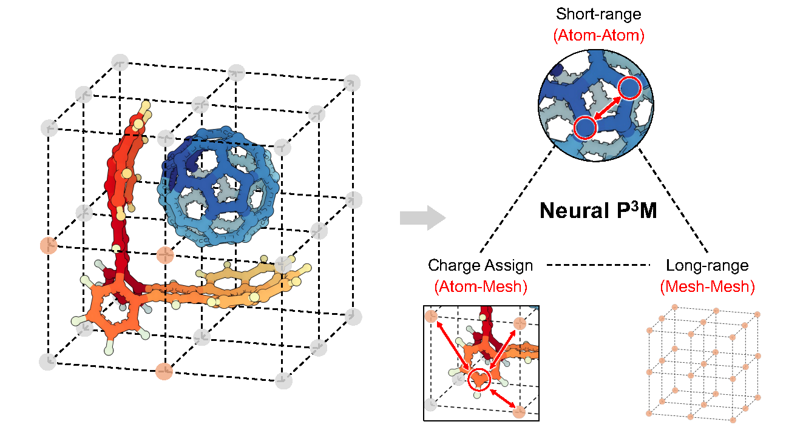

<div align="center">

# Reference Implementation about Neural P<sup>3</sup>M: A Long-Range Interaction Modeling Enhancer for Geometric GNNs

<a href="https://pytorch.org/get-started/locally/"></a>
<a href="https://pytorchlightning.ai/"></a>
<a href="https://hydra.cc/"></a>
<a href="https://github.com/ashleve/lightning-hydra-template"></a><br>

</div>

## Description

Neural P<sup>3</sup>M, a versatile enhancer of geometric GNNs to expand the scope of their capabilities by incorporating mesh points alongside atoms and reimaging traditional mathematical operations in a trainable manner.

Authors: Yusong Wang#, Chaoran Cheng#, Shaoning Li#, Yuxuan Ren, Bin Shao, Ge Liu, Pheng-Ann Heng, Nanning Zheng*

(#Equal contribution, *Corresponding authors)

 


## Installation

```bash
# create conda environment and install dependencies
conda env create -f environment.yml -n np3m

# activate conda environment
conda activate np3m

# hydra
pip install hydra-core==1.3.2 hydra-colorlog==1.2.0 hydra-optuna-sweeper==1.2.0

# Pytorch Geometric
pip install pyg_lib torch_scatter torch_sparse torch_cluster torch_spline_conv -f https://data.pyg.org/whl/torch-2.2.0+cu121.html

# Pytorch Lightning and others
pip install lightning torchmetrics rootutils pre-commit rich pytest lmdb
```

## Getting started

### Training

Train model with chosen experiment configuration from [configs/experiment](configs/experiment/).

```bash
python src/train.py experiment=experiment_name.yaml
```

You can override any parameter from command line like this:

```bash
python src/train.py model.hparams.lr=XXX
```

### Inference

Once model is trained, to use a pretrained checkpoint for inference, simply run:

```bash
python src/eval.py experiment=experiment_name.yaml ckpt_path=ckpt_name.ckpt
```

We also provide some pre-trained models in [pretrained_ckpt](pretrained_ckpt).

## Contact

Please contact [Yusong Wang](https://yusowa0716.github.io/) for technical support.
